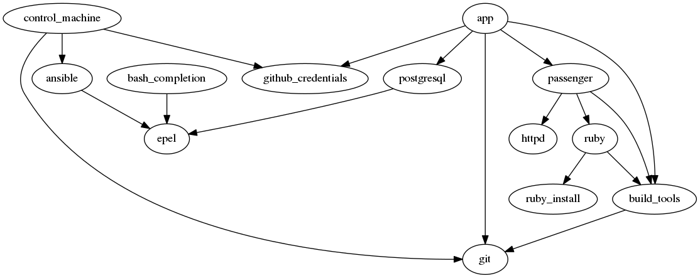

# ansible-roles-graph

Generate a graph of Ansible role dependencies.

## Install

    pip install ansible-roles-graph

Assuming you already installed [graphviz](http://www.graphviz.org/)
with [python bindings](http://www.graphviz.org/pdf/gv.3python.pdf).

## Usage

Quite simply:

    ansible-roles-graph

Will look for roles in the `./roles/` directory, and generate an `./ansible-roles.png` file.

The command also accepts multiple role directories or playbooks and various options:

    ansible-roles-graph -o schema.png -f png -x role_to_exclude playbook.yml

See `ansible-roles-graph --help` for more info.

## News
This is a friendly fork with bug fixes and new features. It includes patches of
Jeremy Yoder, Florian Schüller and Robin Schneider. New features:
- You can supply a playbook – the script will render all roles used by this playbook
- You can exclude roles from being rendered (for better overview, `-e role1,role2`)
- If not specified, the file type is guessed from file extension

## Output

## License

[GNU GPLv3 or later](https://www.gnu.org/licenses/gpl.html)
